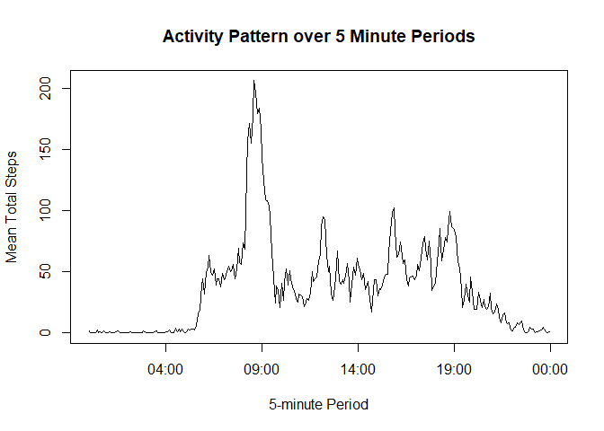
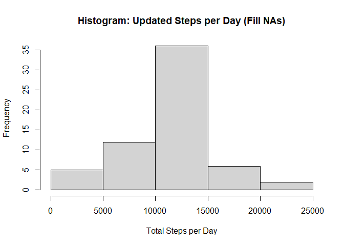

```r
# Load all libraries
library(tidyverse)
```

```
## -- Attaching packages --------------------------------------- tidyverse 1.3.1 --
```

```
## v ggplot2 3.3.5     v purrr   0.3.4
## v tibble  3.1.2     v dplyr   1.0.7
## v tidyr   1.1.3     v stringr 1.4.0
## v readr   1.4.0     v forcats 0.5.1
```

```
## -- Conflicts ------------------------------------------ tidyverse_conflicts() --
## x dplyr::filter() masks stats::filter()
## x dplyr::lag()    masks stats::lag()
```


## Loading and preprocessing the data


```r
activity <- read.csv("activity.csv", header = TRUE)
activity$interval <- sprintf("%04d", activity$interval)
activity$interval <- format(strptime(activity$interval, format="%H%M"), format = "%H:%M")
activity$date_time <- paste(activity$date, activity$interval)
activity$date_time <- as.POSIXct(activity$date_time, format = "%Y-%m-%d %H:%M")
```


## What is mean total number of steps taken per day?

#### Histogram of Steps Per Day

```r
steps_day <- activity %>% group_by(as.Date(activity$date_time)) %>%
        summarise(total_per_day = sum(steps, na.rm = TRUE))
hist(steps_day$total_per_day, main = "Histogram: Steps per Day", 
     xlab = "Total Steps per Day")
```

<!-- -->

#### Mean and Median Steps per Day

```r
mean_steps <- mean(steps_day$total_per_day, na.rm = TRUE)
median_steps <- median(steps_day$total_per_day, na.rm = TRUE)

print(paste0("Mean Steps per Day is ", round(mean_steps,2)))
```

```
## [1] "Mean Steps per Day is 9203.35"
```

```r
print(paste0("Median Steps per Day is ", round(median_steps,2)))
```

```
## [1] "Median Steps per Day is 10490.5"
```


## What is the average daily activity pattern?


#### Activity peaks up at 8:35 am, hovers between 25-100 throughout the day and
#### tapers off after 7 pm.

```r
steps_interval <- activity %>% group_by(interval) %>%
        summarise(mean_per_interval = mean(steps, na.rm = TRUE))
steps_interval$interval <- as.POSIXct(steps_interval$interval, format = "%H:%M")

plot(x = steps_interval$interval, y = steps_interval$mean_per_interval, 
     type = 'l', main = "Activity Pattern over 5 Minute Periods", 
     xlab = "5-minute Period",
     ylab = "Mean Total Steps")

abline(h = mean(steps_interval$interval), col = 'red')
```

<!-- -->

#### Maximum mean number of steps

```r
max_steps = steps_interval %>% filter(mean_per_interval == max(mean_per_interval, na.rm = TRUE))
max_steps$interval <- format(max_steps$interval, format = "%H:%M")
print(paste0("Maximum mean number of steps over a 5 minute period is ", 
             round(max_steps$mean_per_interval,2), 
             " and it occurs in the morning at ", max_steps$interval))
```

```
## [1] "Maximum mean number of steps over a 5 minute period is 206.17 and it occurs in the morning at 08:35"
```


## Imputing missing values

#### Total Number of Missing Values

```r
total_nas <- sum(is.na(activity$steps))
print(paste0("Total number of missing values (NAs in column steps) is ", total_nas))
```

```
## [1] "Total number of missing values (NAs in column steps) is 2304"
```


#### Fill in NAs by the Mean of the number of steps of each respective time interval

```r
new_activity_df <- activity %>%  group_by(interval) %>%
  mutate_all(funs(ifelse(is.na(.), mean(., na.rm = TRUE),.)))
```

```
## `mutate_all()` ignored the following grouping variables:
## Column `interval`
## Use `mutate_at(df, vars(-group_cols()), myoperation)` to silence the message.
```

```
## Warning: `funs()` was deprecated in dplyr 0.8.0.
## Please use a list of either functions or lambdas: 
## 
##   # Simple named list: 
##   list(mean = mean, median = median)
## 
##   # Auto named with `tibble::lst()`: 
##   tibble::lst(mean, median)
## 
##   # Using lambdas
##   list(~ mean(., trim = .2), ~ median(., na.rm = TRUE))
```

```r
new_activity_df$date_time <- paste(new_activity_df$date, new_activity_df$interval)
new_activity_df$date_time <- as.POSIXct(new_activity_df$date_time, format = "%Y-%m-%d %H:%M")


new_steps_day <- new_activity_df %>% group_by(as.Date(new_activity_df$date)) %>%
        summarise(total_per_day = sum(steps, na.rm = TRUE))
hist(new_steps_day$total_per_day, main = "Histogram: Updated Steps per Day (Fill NAs)", 
     xlab = "Total Steps per Day")
```

<!-- -->


#### With NAs filled in using mean of respective intervals, the mean and the median of the number of 
#### steps are higher compared to the original data.


```r
new_mean_steps <- mean(new_steps_day$total_per_day, na.rm = TRUE)
new_median_steps <- median(new_steps_day$total_per_day, na.rm = TRUE)

print(paste0("Updated Mean Steps per Day is ", round(new_mean_steps,2)))
```

```
## [1] "Updated Mean Steps per Day is 10766.19"
```

```r
print(paste0("Median Steps per Day is ", round(new_median_steps,2)))
```

```
## [1] "Median Steps per Day is 10766.19"
```


## Are there differences in activity patterns between weekdays and weekends?

#### Activity pick up a bit later in the morning and has more peaks throughout the day on weekends compared to weekdays.

```r
new_activity_df$week <- ifelse(weekdays(new_activity_df$date_time) %in% c("Saturday", "Sunday"), "weekend", "weekday")

new_steps_interval <- new_activity_df %>% group_by(week, interval) %>%
        summarise(mean_per_interval = mean(steps, na.rm = TRUE))
```

```
## `summarise()` has grouped output by 'week'. You can override using the `.groups` argument.
```

```r
new_steps_interval$interval <- as.POSIXct(new_steps_interval$interval, format = "%H:%M")

g <- ggplot(new_steps_interval, aes(x = interval, y = mean_per_interval)) + geom_line()
g + facet_grid(rows = vars(week)) + scale_x_datetime(date_breaks = "3 hour",
                       date_labels = "%I:%M %p") + labs(title = "Activity Pattern: Weekdays vs Weekends",
                                                        x = "5-minute Time Interval",
                                                        y = "Mean Number of Steps")
```

<!-- -->


